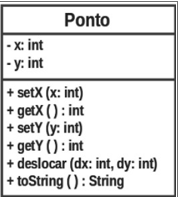
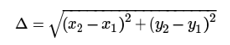
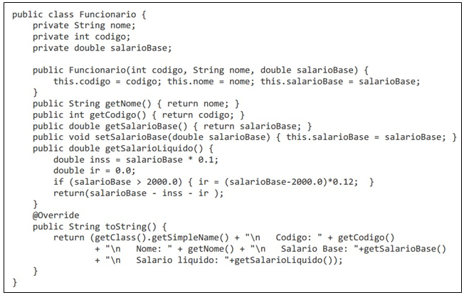

<h1> Lista de Exercícios – Revisão POO </h1>

## 1. Altere a classe Ponto apresentada abaixo para apresentar:

 
    • Crie um construtor que recebe dois parâmetros de coordenadas X e Y;

    • Introduza um atributo de classe para contar o número de objetos criados;

    • Faça com que o construtor atualize o contador de pontos;

    • Acrescente um método de classe para retornar o valor desse atributo de contagem;

    • Acrescente um método para calcular e retornar a distância entre a instância do ponto e um outro objeto Ponto qualquer;

    • Acrescente um método para calcular e retornar distância entre a instância do ponto e um outro ponto dado pelas coordenadas X e Y;

    • Acrescente um método para calcular e retornar a distância entre dois pontos, dadas as coordenadas X1, Y1 e X2, Y2 (como este método não utiliza nenhum atributo para fazer este cálculo, ele pode ser criado como um método de classe).
    
> A distância entre dois pontos é calculada por:

     

     
## 2. Analise o código da classe Funcionario

> ### A partir dessa classe, desenvolva as seguintes classes:

    • Servente: classe derivada da classe Funcionario. Um servente recebe um adicional de 5% a título de insalubridade;

    • Motorista: classe derivada da classe Funcionario. Para cada motorista é necessário armazenar o número da carteira de motorista;

    • MestreDeObras: classe derivada da classe Servente. Para cada mestre de obras é necessário armazenar quantos funcionarios estão sob sua supervisão; 

    • Um mestre de obras ganha um adicional de 10% para cada grupo de 10 funcionários que estão sob seu comando;

    • Em todas as classes devem ser acrescentados os métodos get/set necessários;

## 3. Crie a seguinte hierarquia para representar diferentes tipos de telefones:
>

    • Telefone: abstrata, representa o DDD e o número de um telefone, define um método abstrato calculaCusto (da ligação, recebe como parâmetro o tempo da ligacão);

    • Fixo: derivada de Telefone, também armazena o custo por minuto, e sobrescreve calculaCusto, multiplicando o tempo da ligacão pelo custo do minuto;

    • Celular: abstrata, derivada de Telefone, também armazena o custo do minuto base, e o nome da operadora;

    • PrePago: derivada de Celular, calcula o custo da ligacão aplicando um acréscimo de 40% no custo do minuto base;

    • PosPago: derivada de Celular, calcula o custo da ligacão aplicando um desconto de 10% no custo do minuto base;